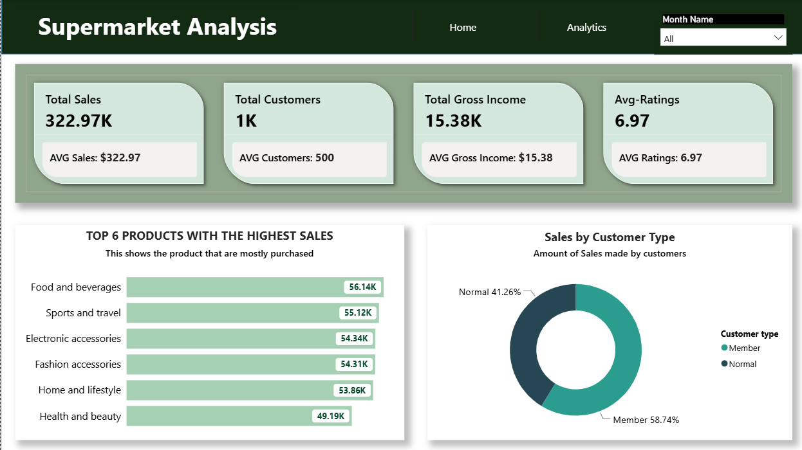
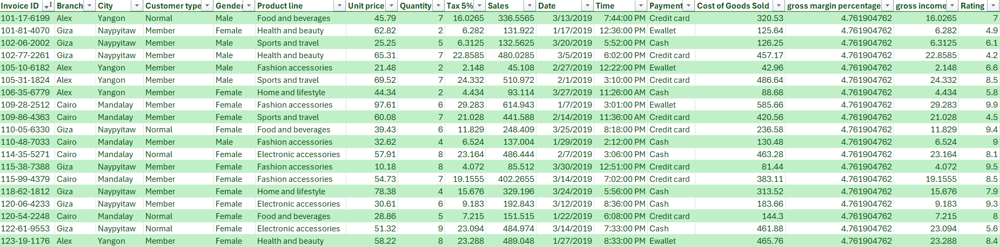

# Supermarket Sales Performance Report 
Analyzing 3 months of supermarket transaction data to uncover sales trends, customer behavior, and profitability insights using Power BI.

## Executive Summary
- The supermarket management lacked a centralized reporting system to monitor sales performance, customer behavior, and product performance. Decision-makers relied on raw transactional data, making it difficult to identify high-performing product lines, understand customer preferences, and evaluate revenue across different branches.

- To solve this challenge, I developed an interactive Power BI dashboard that transformed over 1,000 supermarket transactions into meaningful business insights. The dashboard provides real-time visibility into key performance indicators (KPIs), customer demographics, payment preferences, branch performance, and product sales.

- The analysis revealed that the supermarket generated approximately $322.97K in total sales with over 1,000 customers, while Food & Beverages emerged as the highest-selling product line. Members contributed nearly 59% of total sales, indicating stronger customer loyalty, while digital payment methods accounted for almost 70% of all transactions. These insights provide management with the information needed to improve marketing strategies, inventory planning, and customer retention.

## The Business Problem
The supermarket required a centralized reporting solution to better understand its sales performance and customer purchasing behavior across multiple branches.

Management wanted to move beyond static spreadsheets and gain an interactive dashboard capable of supporting faster, data-driven business decisions.

## Key Questions Addressed:
- What are the overall sales and profitability metrics?
- Which product lines generate the highest revenue?
- Which branches contribute the most sales?
- How do customer ratings influence sales?
- What payment methods do customers prefer?
- What percentage of sales comes from Members versus Normal customers?
- How do product preferences differ between male and female customers?

## The Process (Methodology)
### Tools Used
- Microsoft Power BI, Power Query, DAX

## Data Source & Overview
The dataset consists of 1,001 sales transactions with 18 columns, capturing supermarket operations across three branches. 

It includes customer information, product lines, payment methods, sales, gross income, and customer ratings used to analyze business performance.

## Data Cleaning & Transformation (ETL)
Using Power Query, the dataset was prepared for analysis by:
- Removing duplicate records
- Checking for missing values
- Standardizing data types
- Cleaning inconsistent text values
- Creating calculated measures using DAX
- Building relationships between tables where required

## Data Preview
 

## Analysis & Insights
This dashboard uncovers key business insights across sales performance, customer behaviour, and product performance.
  
### Overall Sales Performance
The supermarket generated approximately $322.97K in total sales from 1,000 customers, producing $15.38K in gross income.
The average customer rating of 6.97 suggests customers are generally satisfied with their shopping experience, although there is room for improvement.

### Product Line Performance
Among the six product lines:
- Food and Beverages generated the highest sales ($56.14K).
- Sports and Travel closely followed with $55.12K.
- Electronic Accessories and Fashion Accessories also performed strongly.
- Health and Beauty recorded the lowest revenue ($49.19K).

The relatively small differences among the top five categories indicate a balanced product portfolio, although Health & Beauty may require additional promotional efforts.

### Customer Behaviour
Customer loyalty plays a significant role in revenue generation.
- Members contributed 58.74% of total sales.
- Normal customers accounted for 41.26%.
This indicates that the supermarket's membership program successfully encourages repeat purchases and generates higher revenue.

### Payment Method Analysis
Customer payment preferences are distributed fairly evenly:
- E-wallet – 34.5%
- Cash – 34.4%
- Credit Card – 31.1%
  
The balanced distribution suggests customers appreciate multiple payment options, with digital payments slightly outperforming traditional payment methods.

### Branch Performance
Sales were fairly balanced across all three branches:
- Naypyitaw	        $110.57K
- Mandalay	        $106.20K
- Yangon	          $106.18K

Naypyitaw slightly outperformed the other branches, suggesting opportunities to study its operational practices and replicate them elsewhere.

### Customer Ratings vs Sales
The scatter plot shows only a weak relationship between customer ratings and sales value.

Higher customer ratings do not necessarily result in higher transaction values, indicating that purchasing decisions are influenced more by customer needs, pricing, and product availability than by satisfaction scores alone.

### Gender & Product Preferences
Both male and female customers purchased products across all six product lines.
Key observations include:
- Female customers generated higher sales in Food & Beverages and Sports & Travel.
- Male customers showed relatively balanced purchasing across categories.
- Overall purchasing behaviour is similar between genders, suggesting that marketing campaigns should focus more on customer preferences than gender-specific promotions.

## Recommendations
Based on the analysis, I recommend the following actions:
- Strengthen the membership program through exclusive discounts, reward points, and personalized offers, as Members contribute nearly 59% of total sales.
- Increase marketing efforts for the Health & Beauty category through promotions, bundles, and targeted campaigns to improve revenue.
- Continue supporting multiple payment methods, especially digital payment options, to maintain customer convenience.
- Investigate the operational practices of the Naypyitaw branch and replicate successful strategies across Mandalay and Yangon.
- Monitor customer satisfaction continuously to identify service improvements that may increase repeat purchases and customer loyalty.
- Use sales insights to optimize inventory levels for high-performing categories such as Food & Beverages and Sports & Travel, reducing stock shortages while minimizing overstock in slower-moving categories.

## Links
[Interactive PowerBI Dashboard](https://app.powerbi.com/groups/me/reports/315ca417-1aa2-4fc5-bb20-65e99aadfb84/7084e6251fe1095ffcf8?redirectedFromSignup=1&experience=power-bi)

